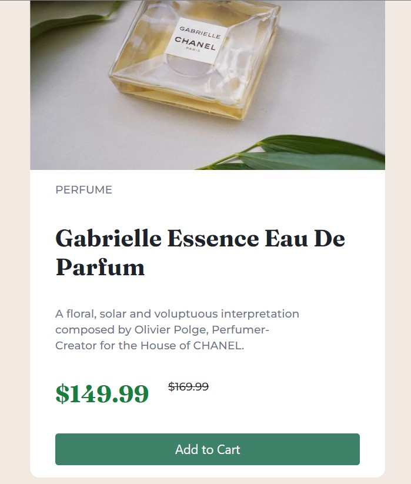

# Frontend Mentor - Product preview card component solution

This is a solution to the [Product preview card component challenge on Frontend Mentor](https://www.frontendmentor.io/challenges/product-preview-card-component-GO7UmttRfa). Frontend Mentor challenges help you improve your coding skills by building realistic projects.

## Table of contents

- [Overview](#overview)
  - [The challenge](#the-challenge)
  - [Screenshot](#screenshot)
  - [Links](#links)
- [My process](#my-process)
  - [Built with](#built-with)
  - [What I learned](#what-i-learned)
  - [Continued development](#continued-development)
  - [Useful resources](#useful-resources)
- [Author](#author)
- [Acknowledgments](#acknowledgments)

**Note: Delete this note and update the table of contents based on what sections you keep.**

## Overview

### The challenge

Users should be able to:

- View the optimal layout depending on their device's screen size
- See hover and focus states for interactive elements

### Screenshot

### Links

- Live Site URL: [Live Link](https://taupe-cajeta-75b9c9.netlify.app/)

## My process

This was pretty basic card. I used Tailwind and built from a mobile first perspective. Nothing crazy but a fun little project none-the-less.

### Built with

- Semantic HTML5 markup
- CSS custom properties
- Flexbox
- TailwindCSS
- Mobile-first workflow

**Note: These are just examples. Delete this note and replace the list above with your own choices**

### What I learned

This was my first time doing a Frontend Mentor exercise completely using Tailwind. I experimented and found a good workflow in building mobile first with Tailwind and was able to frame this out fairly quickly. I used custom colors in Tailwind for the first time and also tried to use Tailwind base properties as much as possible so it's not as pixel perfect but maintains a very consistent look.

### Continued development

Next steps will be to build out a few basic websites completely in Tailwind. I'd also like to learn more about customizing components in Tailwind. React's component based framework will be particularly useful with Tailwind.

## Author

- Website - [Ben Thrasher](https://www.benthrasher.dev)
- Frontend Mentor - [@binthroot](https://www.frontendmentor.io/profile/binthroot)
- Twitter - [@bennythrash](https://www.twitter.com/bennythrash)
